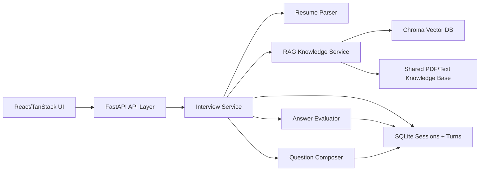

# PGAGI Candidate Screening System

A role-based candidate screening system with a slim React frontend and a FastAPI backend that implements a local, traceable RAG interview pipeline.

## What is implemented

- Resume upload for PDF or text files
- Role selection for `AI / ML Engineer`, `Backend Engineer`, `Frontend Engineer`, `Full-Stack Engineer`, `Data Engineer`, and `DevOps / SRE`
- Resume parsing with skill, technology, domain, and seniority extraction
- Primary-source knowledge ingestion from a single shared PDF, text, or Markdown source directory
- Fallback role corpora under `backend/data/knowledge_base/*.md` when no primary document is available
- Chunking plus local embeddings with `sentence-transformers/all-mpnet-base-v2`
- Persistent vector retrieval with Chroma and optional cross-encoder reranking
- Evidence-driven question generation with optional local `google/flan-t5-small` generation fallback
- SQLite-backed interview session and transcript storage
- Adaptive question flow with traceable `query -> sources -> question -> answer -> summary`
- Structured session summary with grounded signals and transcript export

## Project structure

- `frontend/`: React + TanStack Start interview UI
- `backend/`: FastAPI app, services, persistence, ingestion, and knowledge base
- `.env.example`: environment variables for local configuration

## System Architecture



The frontend owns the candidate journey: setup, interview, and results. The backend owns all business logic: resume parsing, interview planning, retrieval, question generation, answer evaluation, and persistence. SQLite stores sessions, questions, answers, evaluations, and final reports. Chroma stores embedded knowledge chunks.

## Key Design Decisions

- A single shared source directory, `backend/data/knowledge_base/source_docs/`, keeps knowledge upload simple. Role-specific behavior comes from role-aware queries, resume signals, and question blueprints rather than duplicated source folders.
- Source ingestion skips README files and assignment/spec PDFs so only actual knowledge material is embedded.
- Chunks use overlap to preserve context across page boundaries, then are embedded with `sentence-transformers/all-mpnet-base-v2`.
- Retrieval combines vector similarity, lightweight lexical overlap, and optional cross-encoder reranking.
- Question generation is evidence-driven: each question stores the query, retrieved chunks, source metadata, and rationale for traceability.
- Resume data affects topic selection, initial difficulty, and adaptive follow-up direction.
- The answer evaluator is intentionally lightweight and explainable, producing scores for grounding, clarity, specificity, and depth rather than a black-box pass/fail.

## Backend run

```bash
source .venv/bin/activate
uvicorn backend.app.main:app --reload
```

The API starts at `http://127.0.0.1:8000` and exposes:

- `GET /api/health`
- `GET /api/roles`
- `POST /api/interviews/sessions`
- `POST /api/interviews/sessions/{session_id}/answers`
- `GET /api/interviews/sessions/{session_id}/summary`
- `GET /api/knowledge/status`

## Frontend run

```bash
cd frontend
npm run dev
```

The frontend expects the backend at `http://127.0.0.1:8000/api` by default. Override it with:

```bash
VITE_API_BASE_URL=http://127.0.0.1:8000/api
```

## Notes on the AI/ML core

- Put all books/corpora directly in `backend/data/knowledge_base/source_docs/`. Supported formats are `.pdf`, `.txt`, `.md`, and `.markdown`.
- Assignment/spec PDFs are ignored by ingestion and should not be used as RAG knowledge.
- For the AI/ML role, this repo is wired to use Tom Mitchell's official Machine Learning PDF from CMU (`https://www.cs.cmu.edu/~tom/files/MachineLearningTomMitchell.pdf`) as a primary book when it is present locally.
- Run `python -m backend.scripts.ingest_knowledge` after adding source documents. Chroma persists vectors under `backend/data/chroma`.
- Retrieval first embeds candidate/role-aware queries, then reranks candidates with `cross-encoder/ms-marco-MiniLM-L-6-v2` when enabled.
- Question generation uses retrieved excerpts, resume signals, calibrated difficulty, and answer history. Every turn stores its retrieval trace for auditability.

## Demo Video Checklist

- Start the backend and frontend.
- Show the uploaded knowledge PDFs in `backend/data/knowledge_base/source_docs/`.
- Upload a resume and select a target role.
- Answer at least two interview questions to show session continuity and adaptation.
- Open the results screen and explain the transcript, scores, strengths, improvements, and retrieved source evidence.
