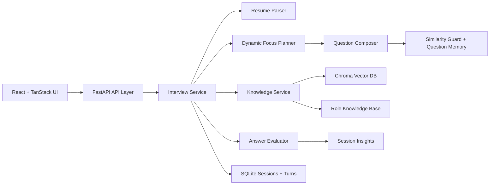

# PGAGI Candidate Screening System

PGAGI is a role-based AI interview screening platform. It uses a React frontend, a FastAPI backend, local resume analysis, RAG retrieval, adaptive question generation, answer evaluation, and a recruiter-style final report.

The project is designed for local, traceable technical screening rather than a generic chatbot flow. Each interview session is grounded in the candidate resume, the selected target role, stored knowledge-base content, and the previous answers in the session.

## Features

- Resume upload for PDF, text, Markdown, and plain text files
- Role selection for AI/ML, Software, Backend, Frontend, Full-Stack, Data Engineering, Data Analysis, Cloud, DevOps/SRE, Cybersecurity, and Testing
- Resume parsing for skills, technologies, frameworks, tools, certifications, projects, work experience, internships, education, achievements, domains, seniority, and highlights
- Role-aware knowledge ingestion from local PDF, text, and Markdown source material
- ChromaDB vector retrieval with sentence-transformer embeddings
- Optional cross-encoder reranking for better retrieval quality
- Dynamic interview planning across skills, projects, scenarios, and fundamentals
- Anti-repetition checks using session history, recent role history, and vector memory
- Local LLM-ready question generation with deterministic fallback behavior
- Semantic answer evaluation with expected answers, scoring, strengths, weaknesses, missing concepts, and improvement suggestions
- SQLite persistence for interview sessions, turns, answers, evaluations, and summaries
- Recruiter-style results dashboard in the frontend
- JSON interview report export
- Generated project documentation artifacts can be kept under `project-docs/generated-docs/`

## Project Structure

```text
project-root/
  backend/
    app/
      api/
      db/
      services/
    data/
      knowledge_base/
      chroma/
    scripts/
  frontend/
    src/
      features/interview/
      lib/
      routes/
  project-docs/
    generated-docs/
  README.md
```

Important paths:

- `backend/app/main.py`: FastAPI application entrypoint
- `backend/app/api/routes.py`: API routes for interviews and knowledge status
- `backend/app/services/interview.py`: interview session orchestration
- `backend/app/services/resume.py`: resume text extraction and profile building
- `backend/app/services/knowledge.py`: Chroma-backed RAG ingestion and retrieval
- `backend/app/services/question_generation.py`: dynamic question generation and question memory
- `backend/app/services/analysis.py`: answer evaluation and final insights
- `frontend/src/features/interview/`: setup, interview, and result screens
- `frontend/src/lib/interview-api.ts`: frontend API client and type mapping
- `project-docs/generated-docs/`: generated project document artifacts, when present

## Architecture



The frontend owns the candidate workflow. The backend owns resume parsing, role planning, retrieval, generation, evaluation, and persistence. Chroma stores embedded knowledge chunks. SQLite stores sessions and interview records.

## Backend Setup

```bash
source .venv/bin/activate
pip install -r backend/requirements.txt
uvicorn backend.app.main:app --reload
```

Backend URL:

```text
http://127.0.0.1:8000
```

## Frontend Setup

```bash
cd frontend
npm install
npm run dev
```

Frontend URL:

```text
http://127.0.0.1:5173
```

By default, the frontend calls:

```text
http://127.0.0.1:8000/api
```

Override with:

```bash
VITE_API_BASE_URL=http://127.0.0.1:8000/api
```

## API Endpoints

- `GET /api/health`
- `GET /api/roles`
- `GET /api/knowledge/status`
- `POST /api/interviews/sessions`
- `POST /api/interviews/sessions/{session_id}/answers`
- `GET /api/interviews/sessions/{session_id}/summary`

## RAG Knowledge Base

Role corpora and source documents live under:

```text
backend/data/knowledge_base/
backend/data/knowledge_base/source_docs/
```

Supported source formats:

- `.pdf`
- `.txt`
- `.md`
- `.markdown`

After adding or changing source material, rebuild the vector index:

```bash
source .venv/bin/activate
python -m backend.scripts.ingest_knowledge
```

Chroma persists vectors under:

```text
backend/data/chroma/
```

## Configuration

Configuration is loaded from environment variables and `.env`. See `.env.example` for available settings.

Key settings:

- `DATABASE_URL`
- `VECTOR_STORE_DIR`
- `KNOWLEDGE_BASE_DIR`
- `EMBEDDING_MODEL_NAME`
- `RERANKER_MODEL_NAME`
- `ENABLE_RERANKING`
- `ENABLE_LOCAL_QUESTION_GENERATION`
- `QUESTION_GENERATOR_MODEL_NAME`
- `QUESTION_GENERATOR_LOCAL_FILES_ONLY`
- `ENABLE_LOCAL_ANSWER_EVALUATION`
- `ANSWER_EVALUATOR_MODEL_NAME`
- `INTERVIEW_QUESTION_COUNT`
- `MAX_CHUNKS_PER_SOURCE_DOC`
- `ALLOWED_ORIGINS`

## Verification

Backend syntax check:

```bash
source .venv/bin/activate
python -m compileall backend/app
```

Frontend checks:

```bash
cd frontend
npm run lint
npm run build
```

## Demo Flow

1. Start the backend.
2. Start the frontend.
3. Upload a resume.
4. Select a target role.
5. Answer the generated interview questions.
6. Review the final results dashboard.
7. Export the JSON interview report if needed.
